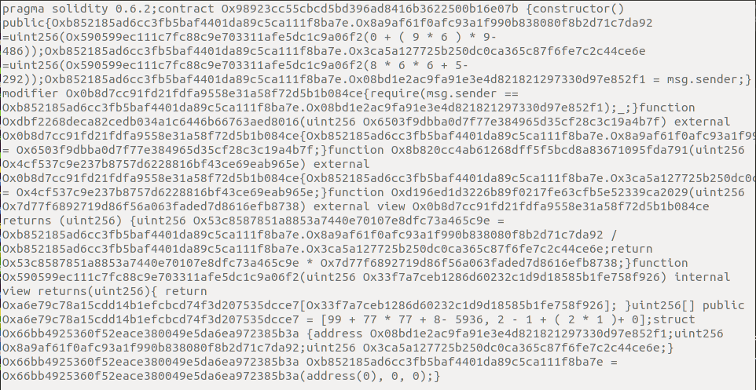

# BiAn(狴犴)


**BiAn** is a source code level code obfuscation tool developed for Solidity smart contracts. We will obfuscate the Solidity smart contract from the following three aspects:
+ **Layout obfuscation**. 
+ **Data flow obfuscation**. 
+ **Control flow obfuscation**. This aspect will be developed by the project collaborator *ZhangMeng*.

## Usage
Enter the following instructions in the terminal (eg., ubuntu os):
```
git clone https://github.com/xf97/BiAn
cd BiAn/src
python main.py yourContract.sol yourContract.sol's_json.ast
```
and you're done.

## Feature completion status
Feature completed:
+ **Layout obfuscation**:
    1. *Delete comments*.
    2. *Disrupt the formatting*.
    3. *Replace variable's name*.
+ **Data flow obfuscation**.
    1. *Convert local variables to state variables*. This feature is turned off by default, because changing local variables to state variables in *Solidity* may cause compile error in the *pure* or *view* function. User can manually modify the configuration file to turn up this feature.
    2. *Dynamically generate static data*.
    3. *Convert integer literals to arithmetic expressions*.
    4. *Split boolean variables*.
    5. *Scalar to vector*.

The configuration file (*Configuration.json*) is a json file, and users can turn on or off various features by modifying this file, and can specify the activation probability of each feature (this function is used to balance the degree of confusion and *gas* growth).

The following features' development has been stopped due to current restrictions. Uncompleted features:
+ **Data flow obfuscation**.
    1. *Collapse and merge arrays*.
    2. *Split functions and contracts*.

## An example
Use **BiAn** (default configuration) to obfuscate the following contract.
Before obfuscation:


After confuscation:


The obfuscated contract can still be compiled (no errors or warnings).

## Input, output, and limitation
**BiAn**'s input: solFile(.sol) and its corresponding jsonAstFile(.json_ast). Users can use the *solc* compiler to generate the corresponding *jsonAst* file.

**BiAn**'s output: The contract after code obfuscation(.sol).

Limited by our technical level, the number of currently available tools and test cases, **BiAn** still has the following limitations:
1. **BiAn** cannot handle the solFile that contains multiple contracts.
2. **BiAn** cannot handle contracts that generate warnings at compile time. We use the local compiler (*solc*) to compile a contract. If a warning is generated when compiling the contract, the local compiler (*solc*) does not output the compilation result, which leads to errors in the following obfuscation steps.
3. **BiAn** may run abnormally when it confuses a contract. We welcome users to submit *bug* issues.

## Possible use 
We hope that **BiAn** can play a role in the following aspects:
+ Enhance bug smart contracts.
+ Protect the contract source code.

## Open source code used in **BiAn**
In the *Convert Integer Literals to Arithmetic Expressions* and *Split boolean variables* function, I use the code from project *Auto-Generate-Expression* (contributed by @threeworld et al). Since our requirements do not exactly match the project *Auto-Generate-Expression*'s function, I rewrite some code.

## License
This program is issued, reproduced or used under the permission of **MIT**. Please indicate the source when using.
